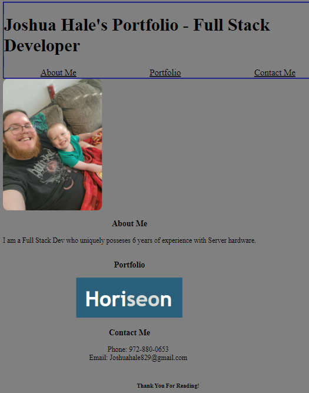

# Joshua-Hale-Portfolio

## Portfolio Project for UTSA Bootcamp

This portfolio will be continually updated as I build, and deploy projects for this course. 

## Screenshots of Application 

## Features

Working navigation links, clickable image of completed project takes you to the deployed page for the project. Meets some accessibility and screen-reader standards, and webpage is responsive to screen-size with color-coded background and text. 

## Link to Website

https://sulxy.github.io/Joshua-Hale-Portfolio/

## Credits

All code, files, and images were supplied by myself. Credit to Martin Harvey, and Angela C. for assisting me when I needed help. 
